<p align="center">
  
</p>

<p align="center">
  
  
  
  
</p>

# Qwen3-VL-Med

Qwen3-VL 医疗视觉语言模型微调与评测的公开工程实践仓库。仓库保留可复用的训练配置、数据转换、推理评测、冻结消融、审计工具和工程结论；不包含任何临床数据、病例文本、逐病例结果、模型权重或内部基础设施信息。

维护者：**Hyhyhyyy**

> **最近更新（2026-08-23，已脱敏）：** 完成R01–R15阶段台账与Phase 3聚合结果；公开R10视觉冻结、R15证据鲁棒训练模板、Oracle/Pipeline报告协议、text-only评测修复，以及Phase 4完整token—视觉token解释性归档工具与规范。

## 工程成果概览

- 构建了病例级多图到报告、单图到描述、证据到诊断等多种任务路线。
- 对全量微调、LoRA以及视觉塔、投影器、语言主干的不同更新状态进行了受控比较。
- 建立了从数据清洗、训练、推理、逐样本评测、配对统计到发布审计的完整流水线。
- 将文本相似度、诊断概念、临床事实代理、数值/分期、结构质量和效率指标分层管理。
- 记录并处理了注意力实现兼容、显存约束、分布式训练、checkpoint保存与重载等工程问题。
- 验证了Oracle/生成证据混合训练可以显著改善真实级联诊断，并公开可复用的数据混合构建器。
- 将解释性归档升级为float16 NPZ、逐head矩阵、视觉token空间映射、manifest和论文热图的可执行协议。
- 为公开发布设置了文件类型、文件大小、敏感模式、语法、测试与 SHA-256 完整性门禁。

公开结论及证据边界见[公开成果与经验](docs/PUBLIC_RESULTS.md)，聚合结果见[Phase 3聚合结果](docs/AGGREGATE_RESULTS.md)，逐Run状态见[R01–R15实验台账](docs/RUN_LEDGER.md)，统一协议见[13项评测机制](docs/STANDARD_EVALUATION.md)，下一阶段见[Phase 4计划](docs/PHASE4_PLAN.md)。

## 隐私与安全边界

本公开仓库**不包含**：

- 临床图像、病例级记录、自由文本报告、预测文本和逐病例指标；
- 医院数据集、患者/就诊/样本标识符以及排除记录；
- 模型、LoRA adapter、优化器、checkpoint或其他权重；
- 内部主机名、账户、远程地址、机构挂载路径、GPU UUID或访问凭据；
- 私有队列上计算的原始结果文件或可反推样本的信息。

示例数据全部为人工合成，不对应任何真实人员。敏感数据即使加密也禁止提交到公共 Git 历史：加密降低可读性，不消除长期泄漏和密钥暴露风险。详细策略见 [数据治理](docs/DATA_GOVERNANCE.md) 和 [发布安全与完整性](docs/RELEASE_SECURITY.md)。

## 仓库结构

```text
code/                         数据构建、清洗、推理与评测代码
code/standard_eval/           13项统一评测的可复用组件
code/evidence_pipeline/       Oracle/生成证据鲁棒混合数据构建
configs/full_sft/             全量微调配置模板
configs/eval/                 评测配置示例
experiments/lora_freezing/    LoRA冻结消融及参数审计
examples/                     仅含人工合成示例
docs/                         实验、指标、复现、隐私与发布文档
tools/privacy_audit.ps1       隐私与敏感文件门禁
tools/privacy_audit_history.py 完整Git历史敏感信息扫描
tools/privacy_audit_commit_metadata.py 单一贡献者与提交元数据门禁
tools/create_private_archive.ps1 仓库外AES-256加密归档
tools/update_release_hashes.ps1  生成公开文件SHA-256清单
```

## 快速开始

1. 在隔离环境安装 Qwen3-VL、LLaMA-Factory、PyTorch、Transformers及本仓库依赖。
2. 将私有数据保存在仓库之外，只复制需要的YAML模板到受控环境。
3. 用受控环境中的真实路径替换 `/path/to/...`，不要提交替换后的本地配置。
4. 注册私有数据集并运行smoke test、checkpoint保存/重载测试，再开始正式训练。
5. 每次提交前运行：

```powershell
powershell -ExecutionPolicy Bypass -File .\tools\privacy_audit.ps1
python .\tools\privacy_audit_history.py
python .\tools\privacy_audit_commit_metadata.py --expected-name Hyhyhyyy --expected-email 235096668+Hyhyhyyy@users.noreply.github.com
```

6. 运行配置，例如：

```bash
FORCE_TORCHRUN=1 llamafactory-cli train experiments/lora_freezing/lora_01_r04_all_components.yaml
```

完整复现顺序见 [复现与核验](docs/REPRODUCIBILITY.md)。

## 关键工程认识

1. **Full、LoRA与冻结不是同一概念。** Full更新原始权重；LoRA冻结目标层原始大权重并训练低秩增量；完全冻结则该模块既不更新原始权重，也没有可训练适配参数。
2. **任务定义与数据质量优先。** 清洗和结构化监督会改变诊断信息学习效果，不能只追求更高的语言重叠分数。
3. **级联会传播遗漏。** 单图证据先生成、再聚合诊断的路线可能把上游遗漏传递到下游，需要同时保存逐图证据与病例级综合监督。
4. **Oracle和Pipeline回答不同问题。** Oracle是人工标准证据条件；Pipeline才是自动级联系统的现实输入，二者不得平均或择优合并。
5. **Full与LoRA没有先验胜者。** 必须在相同数据、病例、任务、解码和临床评价下比较；训练成本只能在诊断安全不下降的候选间作为次级因素。
6. **自动指标不是临床正确率。** BLEU、ROUGE、BERTScore及规则事实指标可用于回归与筛选，但医院使用前仍需病理医师盲评、外部验证和人机协同评价。

## 完整性验证

`RELEASE_SHA256.txt`记录所有公开发布文件（清单自身除外）的SHA-256。运行下列命令重新生成并核对：

```powershell
powershell -ExecutionPolicy Bypass -File .\tools\update_release_hashes.ps1
git diff --exit-code -- RELEASE_SHA256.txt
```

哈希只能证明文件内容是否变化，不能提供保密性，也不能证明临床数据已经匿名化。

私有训练产物不得进入 Git，包括加密后的产物。确需在批准环境间离线转移时，可在仓库外运行 `tools/create_private_archive.ps1` 创建带文件名加密的 AES-256 归档；密钥必须独立管理。

## 临床使用警告

本仓库仅用于研究与工程复现，不是医疗器械。公开结论不能证明模型的临床安全性或诊断性能。任何临床使用前均须经过独立病理专家复核、机构审批、适用场景验证和持续监测。

## 许可

本仓库原创代码与文档采用 [Apache License 2.0](LICENSE)。Qwen基座模型、第三方依赖以及使用者自行接入的数据继续受各自许可证、数据使用协议和伦理审批约束；本许可证不授予任何临床数据或模型权重的使用权。

---

## 本批新增（2026-08-22，已脱敏）

从本地训练成果中整理并**脱敏**后补充的可复用工程资产（不含任何权重、训练数据、逐样本结果、内部主机名或凭据）：

- `configs/lora/`：LoRA 微调基础配置与高显存变体。
- `configs/full_sft/qwen3vl_full_sft.yaml` 与 `qwen3vl_a100_full_sft.yaml.in`：全量微调基础配置与 A100 模板（含 `{{TRAIN_ROOT}}` 等占位符）。
- `scripts/`：一键安装/下载/训练、数据集校验、批量评估、导出清单、NCCL 自检、远端诊断与可复现训练工作流脚本。
- `tools/rebuild_from_initial.ps1`：从原始标注重建训练/测试 JSON 的脱敏转换脚本。
- `docs/ENVIRONMENT.md`、`docs/environment_config.csv`、`docs/environment_snapshot.md`：环境与硬件快照（已隐去云厂商名）。
- `docs/metrics/`：指标定义、冻结消融拆分空表模板与分析说明。
- `docs/CONFIG_PREFLIGHT.md`：各 YAML / DeepSpeed JSON 的**预制要求**与训练前检查清单。
- `docs/RUN_LEDGER.md`：R01–R15 的方法、完成状态、方向性结论和跨阶段比较边界。
- `docs/STANDARD_EVALUATION.md`：13 项统一评测协议，以及当前病例级归因与下一阶段空间热图归档的边界。
- `tools/privacy_audit_history.py`：扫描所有可达 Git blob，防止当前树安全但历史仍残留敏感信息。
- `tools/create_private_archive.ps1`：只用于 Git 仓库外、经授权的 AES-256 加密归档与完整性校验。

> 所有路径均为占位符；训练/数据/凭据均在仓库之外管理，详见 `SECURITY.md` 与 `docs/CONFIG_PREFLIGHT.md`。

## Phase 3最终增量（2026-08-23，已脱敏）

- `configs/full_sft/full_freeze_vision.yaml`：冻结视觉塔、训练projector与语言模型的受控模板。
- `configs/full_sft/evidence_robust_full.yaml`：Oracle/生成证据1:1鲁棒诊断训练模板。
- `code/evidence_pipeline/build_robust_evidence_mix.py`：带split隔离、图像链接、覆盖率和SHA-256清单的数据构建器。
- `code/metric_eval/generate_predictions.py`与`code/standard_eval/confidence_teacherforce.py`：支持纯文本证据任务，不再向Qwen3-VL processor传递空图像列表。
- `code/standard_eval/archive_interpretability.py`：保存完整token×视觉token数组、逐head数据、空间映射、manifest和基础论文热图。
- `docs/AGGREGATE_RESULTS.md`、`ORACLE_PIPELINE_PROTOCOL.md`、`PHASE4_PLAN.md`和`INTERPRETABILITY_ARCHIVE.md`。

所有新增示例均为合成或schema级内容，不包含临床样本、逐病例结果、内部路径、服务器信息或权重。
